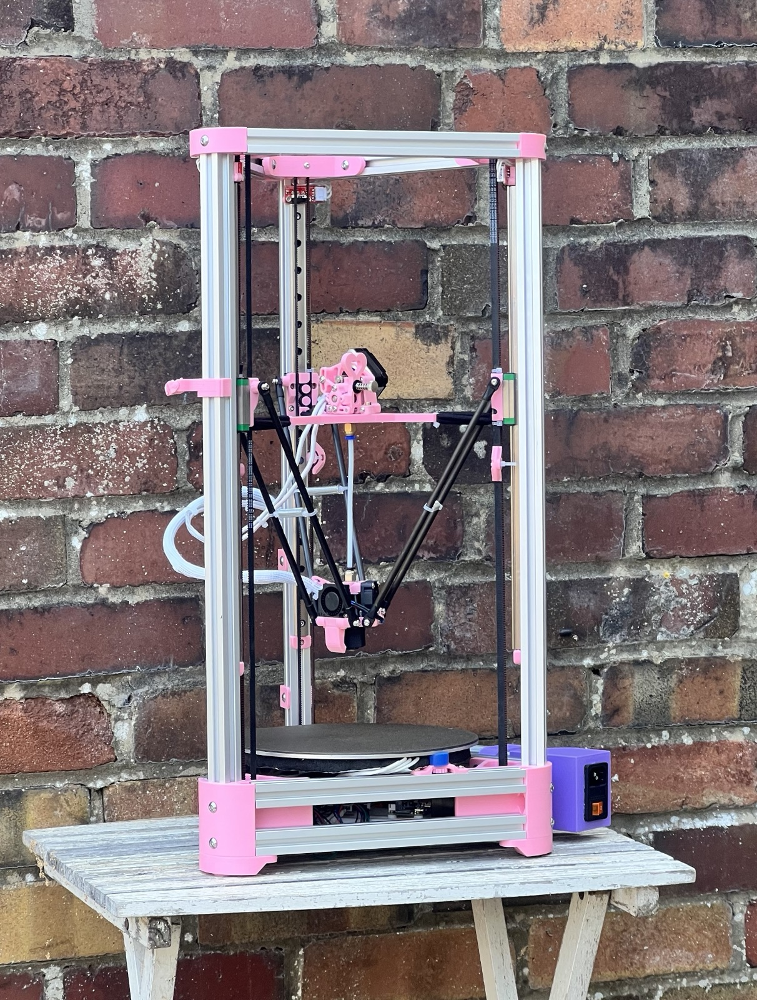

# BDP Kossel Mini

A modern take on the Kossel Mini delta printer using 2020 extrusions, running on an SKR Pico, and a Raspberry Pi Zero, powered by a meanwell UHP-350-24 PSU.

## Assembly

The major components of the printer are split into separate folders. Follow the instructions contained in each of them:
- [Chassis](./models/chassis/README.md)
- [Effector](./models/effector/README.md)
- [Motion](./models/motion/README.md)
- [PSU](./models/PSU/README.md)

## Bill of Materials

The full bill of materials required to build this printer is listed below.

- BTT SKR Pico
- Raspberry Pi Zero W
- Triangle Lab Dragon Ace Volcano hotend
- 220mm aluminum build plate
- 24v Silicon heater
- 3950 Thermistor
- Meanwell UHP-350-24 PSU
- C14 IEC power inlet
- RepRap endstop switch (x3)
- BMG gear kit
- 2020 extrusion 240mm (x6)
- 2020 extrusion 600mm (x2)
- 6mm GT2 belt (approx. 4m)
- 300mm MGN12H linear rail (x3)
- 3010 axial fan (x1)
- 3010 blower fan (x2)
- 4mmx30mm Carbon Fiber Tube (x3)
- Two part epoxy
- M3x6x5mm heat set insert (x15) 
- M3x4x5mm heat set insert (x11)
- M2x2.5x3.2mm heat set insert (x4)
- M5 T-nut (x47)
- M3 T-nuts (x6)
- M3 hex nuts (x3)
- M3 square nut (x2)
- M5x8mm button Head hex bolt (x47)
- M3x18mm button head hex bolt	(x2)
- M3x16mm button head hex bolt	(x2)
- M3x8mm button head hex bolt	(x2)
- M3x14mm hex bolt (x2)
- M3x12mm hex bolt (x2)
- M3x8mm hex bolt (x28)
- M3x6mm hex bolt (x15)
- M2.5x6mm hex bolt (x16)
- M2x4mm hex bolt (x4)
- 7mm OD x 5mm ID x 0.5mm Thick - Spring Steel Shim Washer	(x1)
- 4mm zip ties (x3)

For wiring you will also need 18AWG (for power) and 24AWG silicone wire and JST connectors. I also used 1/4 inch split sleeving and paracord to keep everything neat and tidy.