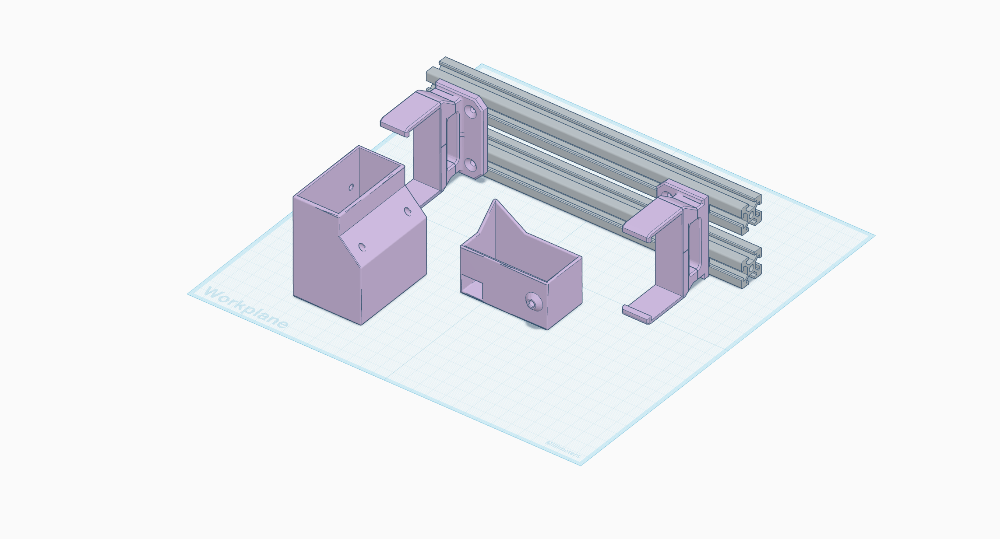

# PSU

This mount is designed to hold the Meanwell UHP-350-24 PSU, which is a 350W 24V power supply. It's a bit of a beast, but it has more than enough power for our needs, and it's also very efficient and reliable. The design here is a remix of [JP3d's design for the the Ratrig V-minion](https://www.printables.com/model/121864-meanwell-uhp-350-24-mount-for-ratrig-v-minion-3d-p/files), but modified to fit the Kossel mini frame spacing.

You'll need to print one `endcap-ac.stl` and one `endcap-dc.stl` for the two ends of the PSU, and `mount-left.stl` and `mount-right.stl` for the mounting brackets. The mount is designed to be bolted to the frame using M5x8mm button head hex bolts and M5 T-nuts. I used 2 M3 heat set inserts in the AC endcap and 1 M3 heat set insert in the DC endcap, but you could also use M3 bolts and nuts if you prefer.

## Bill of Materials

See the [PSU BOM](../../bom/psu.csv) and the generated [compiled BOM](../../bom/README.md).

## Design Source

https://www.tinkercad.com/things/7UkfZWxoEYF-kossel-mini-uhp-350-24-psu-mount
