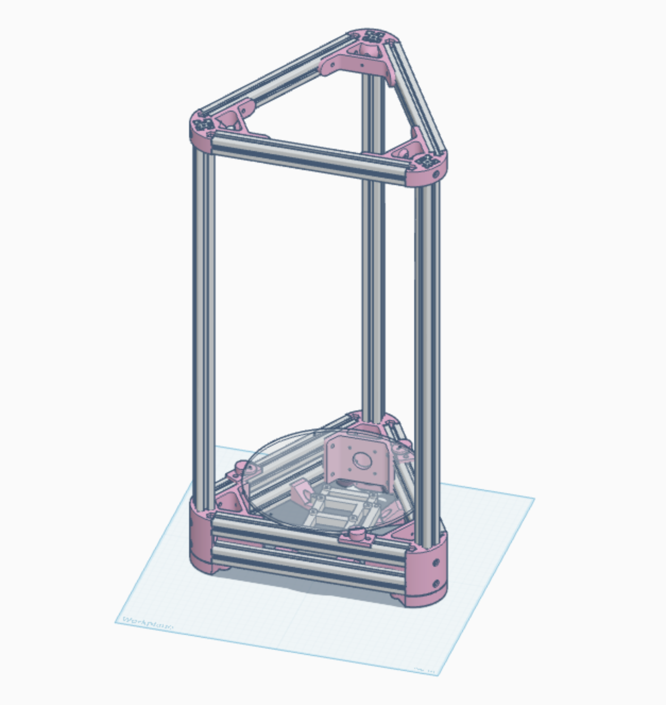

# Chassis

The chassis is designed around the original Kossel 2020 designs.
You'll need 3 x `frame-top.stl`, 3 x `frame-bottom.stl` and 3 x `foot.stl` to print the frame.

The electronics mount in the base, and are designed to fit the SKR Pico and a Raspberry Pi Zero. You'll need two `electronics-mount-front.stl` and two `electronics-mount-back.stl`. These could be the same file, but I haven't done the design work to make them the same yet.

The MCU mount plate is the "no inserts" variant of [Kanrog's Rook Mk1 design](https://www.printables.com/model/388353-rook-mk1-skr-pico-pi-zero-adapter/files).

For assembly, use:
- 2020 extrusion 240mm (x6)
- 2020 extrusion 600mm (x2)
- M5x8mm Button Head hex bolts (x37)
- M3x8mm hex bolts (x10)
- M2.5x6mm hex bolts (x8) - for mounting electronics
- M5 T-nuts (x37)
- M3 T-nuts (x6)