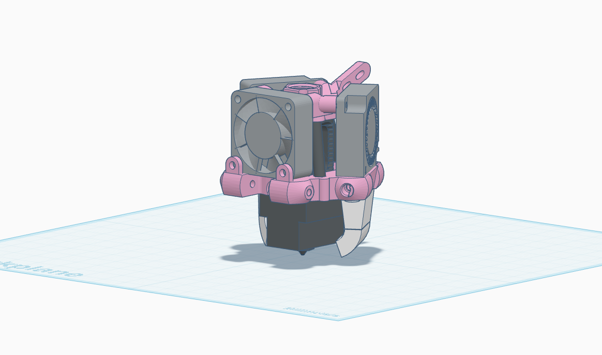
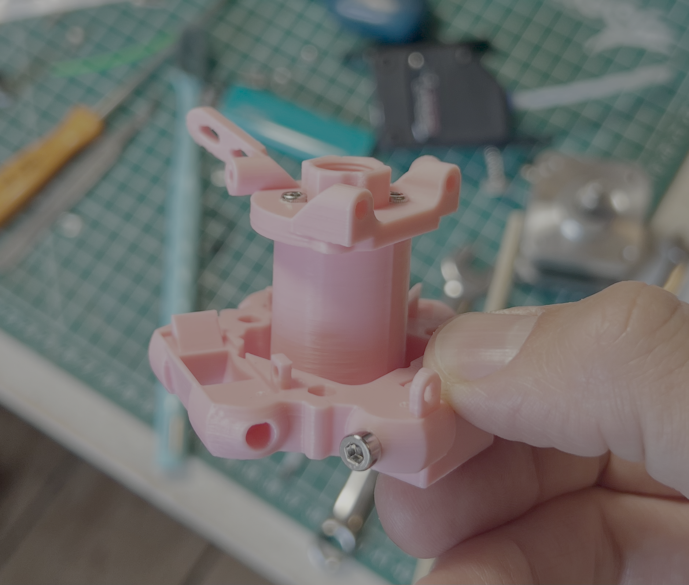
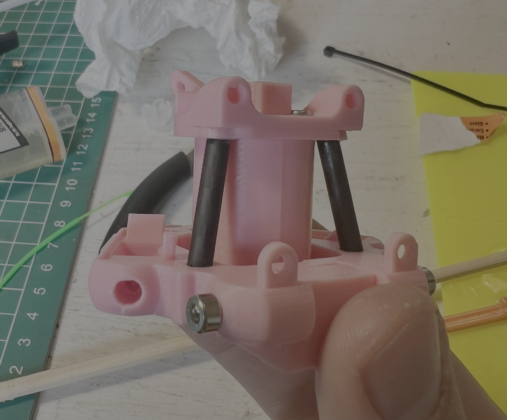
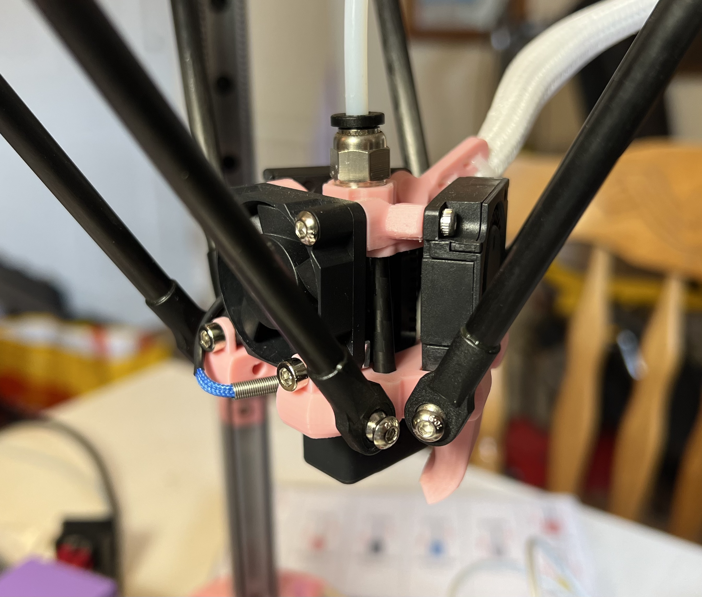

# Effector

The BDP effector is built around the original Kossel 2020 design, retaining the same arm spacing.
It's designed around the Triangle Lab Dragon Ace Volcano hotend ([This one specifically](https://jb3d.uk/product/dav/)), but could be adapted to support other hotends with the same mounting pattern by modifying the Z height of the cooling ducts.
Cooling is provided by a 3010 axial fan for the hotend, and two 3010 blower fans for part cooling.
Assembly also requires three 4mmx30mm Carbon Fiber Tubes.

## Bill of Materials

- Triangle Lab Dragon Ace Volcano hotend
- 3010 axial fan (x1)
- 3010 blower fan (x2)
- 4mmx30mm Carbon Fiber Tubes (x3)
- M3x6x5mm heat set inserts (x6) 
- M2x2.5x3.2mm heat set inserts (x4)
- M2x4mm hex bolts (x4)
- M3x14mm hex bolts (x2)
- M3x12mm hex bolts (x2)
- M3 square nuts (x2)
- M2.5x6mm hex bolts (x8)
- Two part epoxy

## Assembly Guide

1. Print the following parts:
    - `top-plate.stl` (x1)
    - `bottom-plate.stl` (x1)
    - `duct.stl` (x2)
    - `glue-up-jig.stl` (x1)
2. Cut the carbon fiber tubes to 30mm, and clean the ends with a file or sandpaper. Make sure to wear a mask and gloves when working with carbon fiber, as the dust is nasty and makes your skin itch! I recommend keeping everything wet when cutting and sanding to minimize dust.
3. Bolt the top and bottom plate to the glue up jig. This will keep the two plates perfectly parallel while you glue the carbon fiber tubes in place.

4. Mix up your epoxy and apply a small amount to the tube socket in the top plate, and a small amount to the bottom end of the carbon fiber tube. Slide the tube in through the hole in the bottom plate and insert the tube into the socket in the top plate, ensuring it's firmly seated, then wipe away any excess epoxy. Repeat for all three tubes.

5. Let the epoxy cure for at least 24 hours, then remove the glue up jig.
6. Press the M3 heat set inserts into the lateral con rod sockets on the bottom plate.
7. Press the M2 heat set inserts into the duct mounting holes on the underside of the bottom plate.
8. Mount the hotend to the top plate using the M2.5 hex bolts. You will need to route the hotend wires through the gap between the top and bottom plates, with each wire going either side of the carbon fiber tube.
9. Mount the axial fan to the bottom plate using the M3x12mm hex bolts and the M3 square nuts.
10. Mount the blower fans to the bottom plate using the M2.5 hex bolts.
11. Mount the ducts to the bottom plate using the M2 hex bolts.
12. Route the fan and thermistor wires through the gap between the top and bottom plates. 
13. Finish with some nice cable sleeve and zip tie to the cable relief points on the top plate, and you're done!

## Design Source

https://www.tinkercad.com/things/bwVs2w1J2AP-bdp-effector
