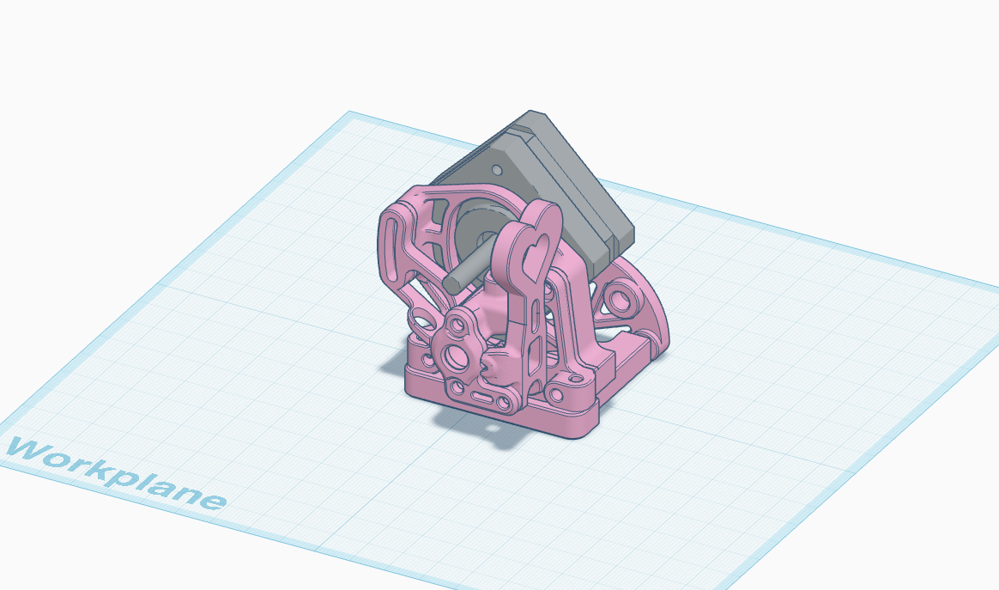
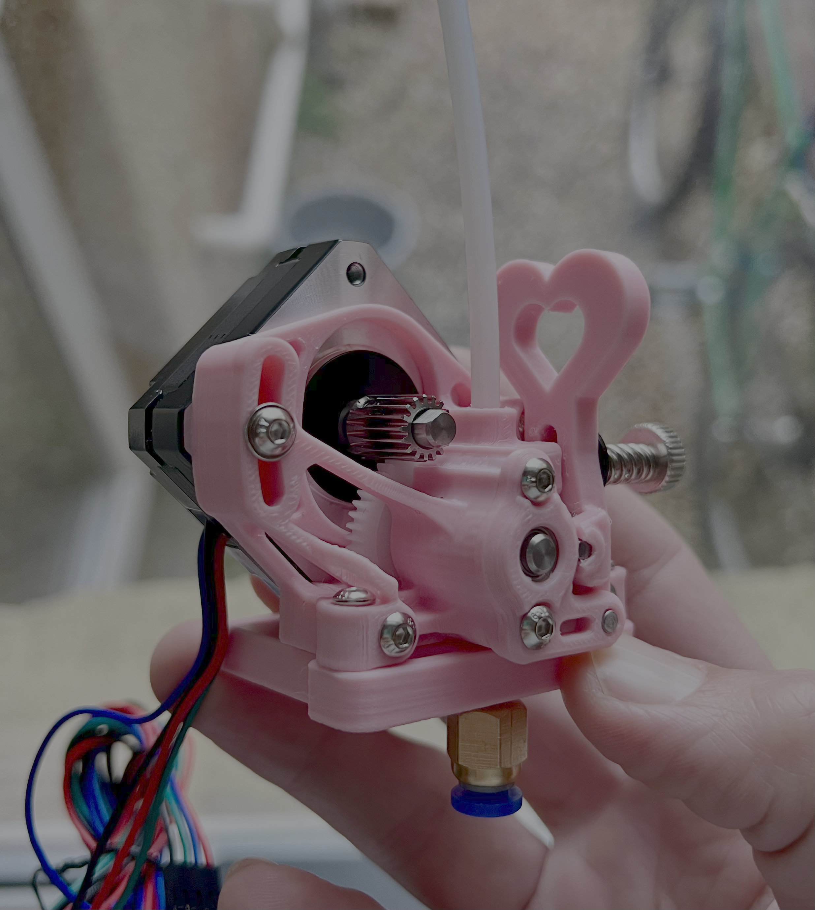
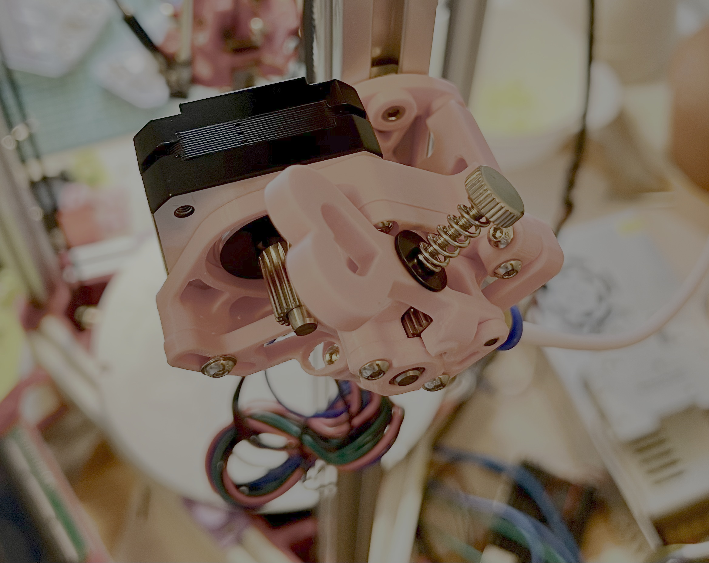

# Sherpa "Extra Lovely" Extruder

This is a remix of the [Sherpa Extra Heavy](https://www.printables.com/model/549890-sherpa-extra-heavy-with-nema17-update-2). 
I found that the original Sherpa Extra Heavy housing was too small for the [BMG gear kit](https://www.aliexpress.com/item/1005007720655144.html) I ordered, which seems to be a common issue with the Sherpa Extra Heavy design. This remix has a slightly larger housing (1.4mm) to accommodate the BMG gear kit, and also includes some aesthetic changes to make it more "lovely".
I've also included a mounting assembly that will allow you to setup the extruder in a Bowden configuration, mounted to the outside of the frame at a 45 degree angle.

## Bill of Materials

- BMG gear kit
- M3x18mm Button Socket Head Cap Screw	(x2)
- M3x16mm Button Socket Head Cap Screw	(x2)
- M3x8mm Button Socket Head Cap Screw	(x2)
- 7mm OD x 5mm ID x 0.5mm Thick - Spring Steel Shim Washer	(x1)
- M3 Brass Heat Stake Threaded Insert - Short	(x2)
- M3 Brass Heat Stake Threaded Insert - Long	(x3)