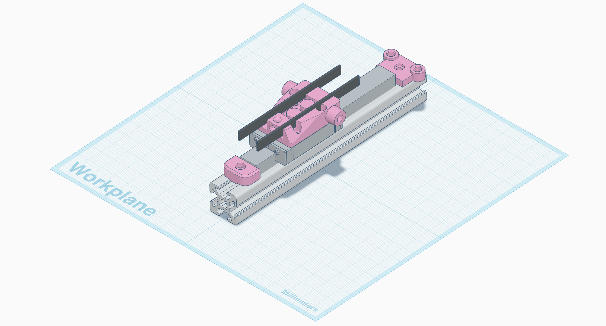

# Motion System

The motion system on the BDP uses 6mm belt, 300mm long MGN12H linear rails, mechanical endstop switches and on-belt tensioners.

You will need to print 3 each of `carriage.stl, `tensioner.stl`, `endstop-mount.stl` and `mgn12-endstop.stl`.

The carriages use m3 6mm heat seat inserts, and the endstop mounts use m3 4mm heat seat inserts. 

The MGN12 endstop is [vale075's design from printables](https://www.printables.com/model/345798-mgn12-rail-stopperendstop), and the tensioner is [Kiolia's universal adjustable belt tensioner](https://www.printables.com/model/157225-universal-adjustable-belt-tensioner), also from printables.

## Bill of Materials

- 6mm GT2 belt (x3)
- 300mm MGN12H linear rail (x3)
- M3x8mm hex bolts (x18)
- M3x6mm hex bolts (x12)
- M3x6mm brass heat set inserts (x6)
- M3x4mm brass heat set inserts (x6)
- 4mm zip ties (x3)
